# ISODATA
Реализация алгоритма ISODATA предназначенного для разделения заданного множества образов на подмножества(кластеры), связанные определенным свойством

Кластеризация начинается с задания значений средних (центров классов) для искомых классов, или берутся значения средних из существующих сигнатур. После отнесения всех возможных образов к одному из кластеров, средние (центры кластеров) пересчитываются. Теперь за центры кластеров принимают значения средних полученных в ходе класификации кластеров, и процесс повторяется полностью сначала (следующая итерация). С каждой последующей итерацией число кластеров может меняться.

Процесс продолжается до тех пор пока не будет достигнуто максимальное количество итераций (заданное вначале).

В данной программе можно вручную задавать начальное и конечное количество кластеров, размер кластеров, минимальное количество образов, входящих в кластер и число итераций.

Рассмотрим результат работы программы на примере. Начальное число кластеров возьмем 2, а желаемое - 4. Минимальное количество образов в кластере 3. Число итераций 20. 

 Для примера сформируем несколько обучающих выборок. На этих выборках кластеры различаются по форме(круглые, сильно вытянутые и неправильной формы), а также по размеру и по близости друг к другу.  Они представлены ниже.

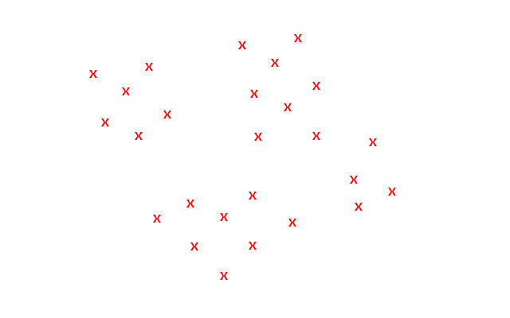  
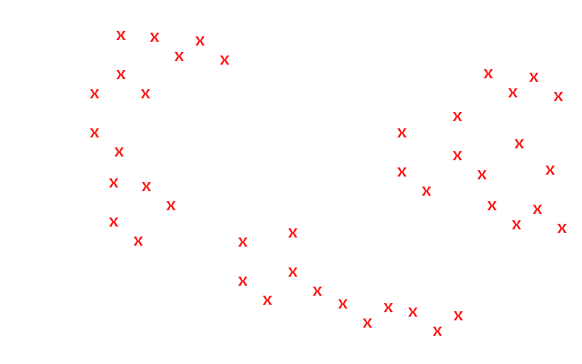  
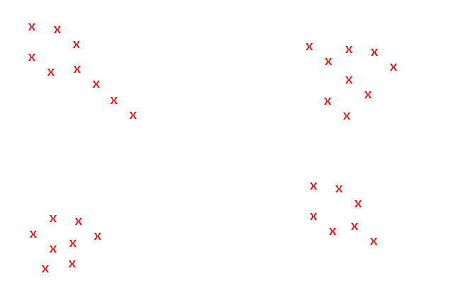  

Также в программе были реализованы несколько методов задания начальных центров кластеров: 
    1. в качестве центров используются первые несколько образов
    2. в качестве центров используются образы, расстояние между которыми минимально
    3. в качестве центров используются образы, расстояние между которыми максимально
Ниже представлены результаты работы алгоритма с разными методами задания центров для нескольких выборок. Синим цветом обозначены начальные центры кластеров, желтым – полученные центры кластеров
Результаты для первого метода выбора начальных центров:

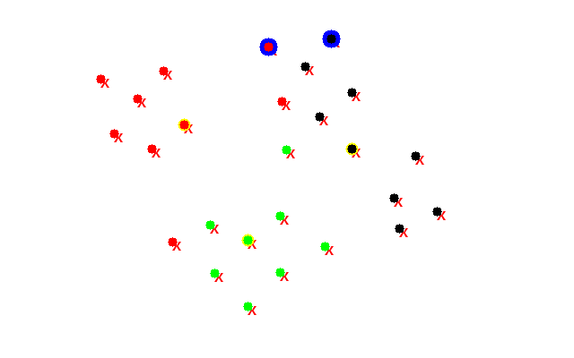

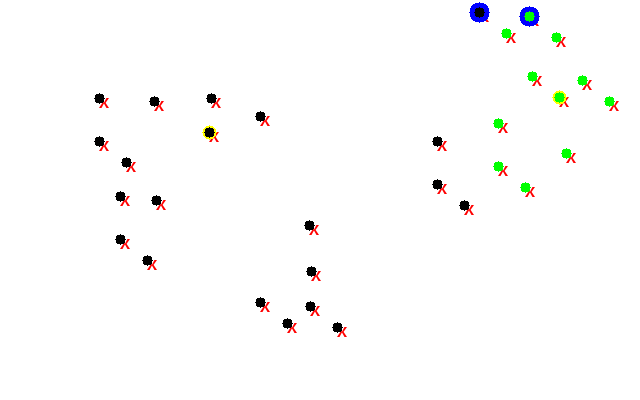

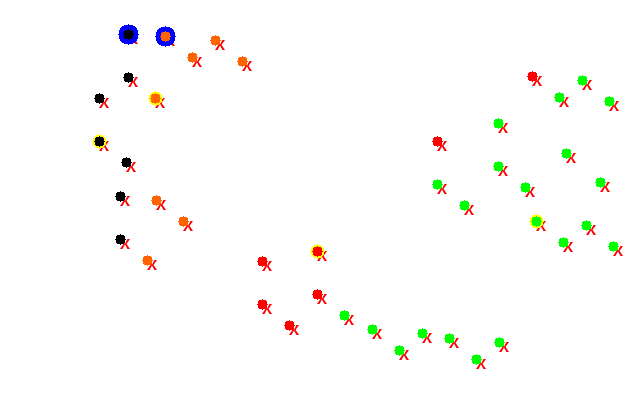

Результаты для второго метода выбора начальных центров:

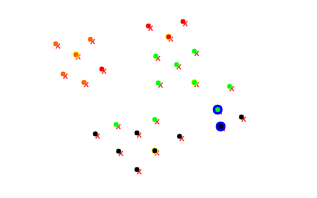

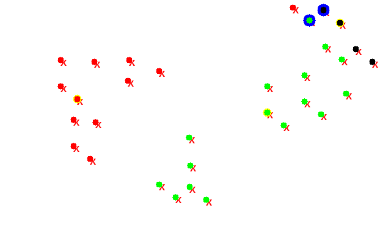

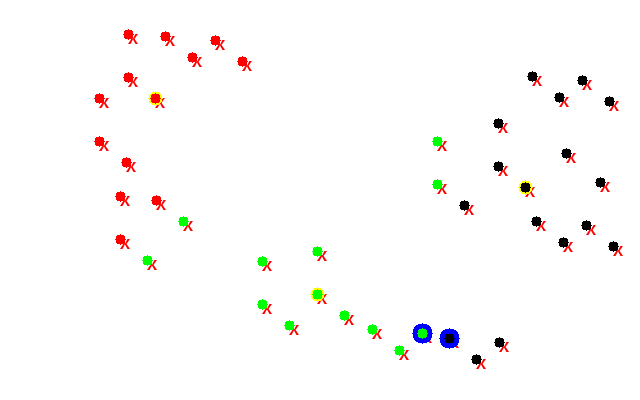

Результаты для третьего метода выбора начальных центров:

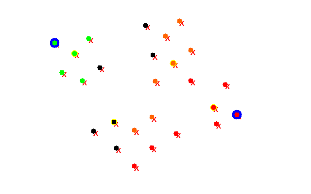

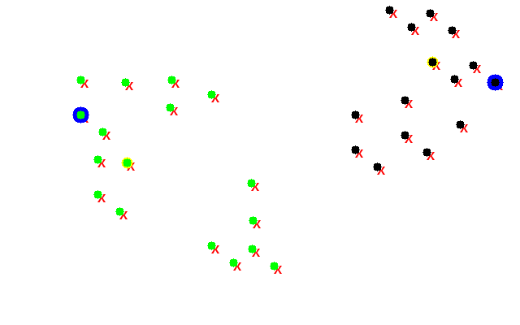
 
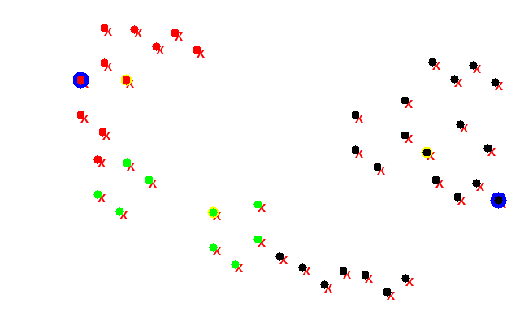 

Из полученных результатов можно сделать вывод, что наиболее верно кластеры определены в том случае, когда выбирались начальные центры с минимальным расстоянием, и наименее верное в случае с выбором первых нескольких образов в качестве центров.
Также можно заметить, что алгоритм правильнее определяет кластеры на выборке, в которой кластеры вытянутой либо неправильной формы, т.к. данный алгоритм строит кластеры преимущественно вытянутой формы.

